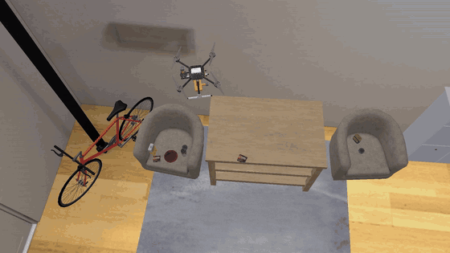
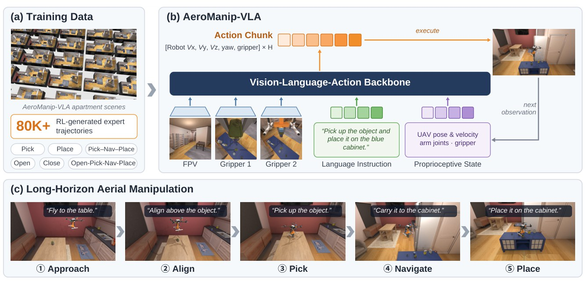
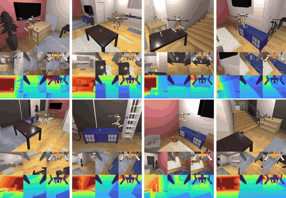

<div align="center">

# AeroManip-VLA

### Scalable Vision-Language-Action Learning for Aerial Manipulation with RL-Generated Demonstrations

**Rui Huang**<sup>1</sup> · **Yanlin Mu**<sup>2,1</sup> · **Lidong Li**<sup>1</sup> · **Yucong Wang**<sup>1</sup> · **Zichen Yan**<sup>1</sup> · **Lin Zhao**<sup>1</sup>

<sup>1</sup>National University of Singapore &nbsp;&nbsp; <sup>2</sup>Beijing Institute of Technology

[](https://ruihuangnus.github.io/AeroManip-VLA-page/)
[](https://arxiv.org/abs/2609.36915)
[](https://youtu.be/1uljytfGFI4)
[](https://www.bilibili.com/video/BV18Qad6oEY7)
[](#)



*From one aerial manipulator to thousands of parallel environments on a single GPU.*

</div>

---

## 📢 News

- **2026-09** — Paper submitted. The [project page](https://ruihuangnus.github.io/AeroManip-VLA-page/) is online with demo videos of every task.
- **2026-09** — Preprint available on [arXiv](https://arxiv.org/abs/2609.36915).
- **Coming soon** — We are preparing the latest version of the dataset. The **data-generation code** and the **dataset** will be released promptly after the paper is accepted. ⭐ Star or watch this repository to get notified.

## 🔍 Overview

AeroManip-VLA is a **GPU-parallel benchmark for aerial Vision-Language-Action (VLA) data generation and policy evaluation**. Reusable reinforcement-learning policies are combined with expert task rules to generate demonstrations **without human teleoperation**, across diverse objects, scenes and randomized initial conditions. Every rollout is automatically annotated for task progress, behavioral outcomes and flight-safety events.

<p align="center">
  
</p>

### Highlights

| | |
|---|---|
| 🗂️ **80K+ demonstrations** | RL-generated expert trajectories, from basic skills to long-horizon tasks |
| 🧩 **5 parameterized skills** | Pick · Place · Nav · Open · Close, composed into long-horizon tasks |
| ⚡ **3,900+ parallel environments** | on a single RTX 5090 — about **6.7×** the throughput of AIR-VLA at comparable GPU memory |
| 🚁 **Two X500-based platforms** | 1-DoF gripper and 3-DoF arm, with a payload-aware low-level controller and PX4-style control allocation |
| 🏷️ **Event annotation** | automatic labeling of tilt, altitude, contact, payload-loss and stability events for structured failure analysis |
| 📊 **Baselines** | ACT, Diffusion Policy, π<sub>0</sub> and π<sub>0.5</sub> evaluated on the benchmark |

## 🎬 Demos

<p align="center">
  
</p>
<p align="center"><i>Expert Pick → Navigate → Place demonstrations (third-person, onboard RGB and depth views).</i></p>

More videos — RL policies, 3-DoF open/close and long-horizon tasks, outdoor package delivery, and failure cases — are on the **[project page](https://ruihuangnus.github.io/AeroManip-VLA-page/)**.

## 🗓️ Release Plan

- [x] Paper submission
- [x] Project page with demo videos
- [x] Full demo video on [YouTube](https://youtu.be/1uljytfGFI4)
- [x] Full demo video on [Bilibili](https://www.bilibili.com/video/BV18Qad6oEY7)
- [x] Paper on [arXiv](https://arxiv.org/abs/2609.36915)
- [ ] Dataset release *(after acceptance)*
- [ ] Data-generation code: simulation, payload-aware control, hybrid expert and RL policies *(after acceptance)*
- [ ] Training and evaluation code for IL / VLA baselines *(after acceptance)*

## 📖 Citation

If you find this work useful, please consider citing:

```bibtex
@article{huang2026aeromanipvla,
  title   = {AeroManip-VLA: Scalable Vision-Language-Action Learning for
             Aerial Manipulation with RL-Generated Demonstrations},
  author  = {Huang, Rui and Mu, Yanlin and Li, Lidong and Wang, Yucong
             and Yan, Zichen and Zhao, Lin},
  journal = {arXiv preprint arXiv:2609.36915},
  year    = {2026}
}
```

## 📬 Contact

For questions or collaboration, please open an issue in this repository or email **Rui Huang** at [ruihuang@u.nus.edu](mailto:ruihuang@u.nus.edu).
